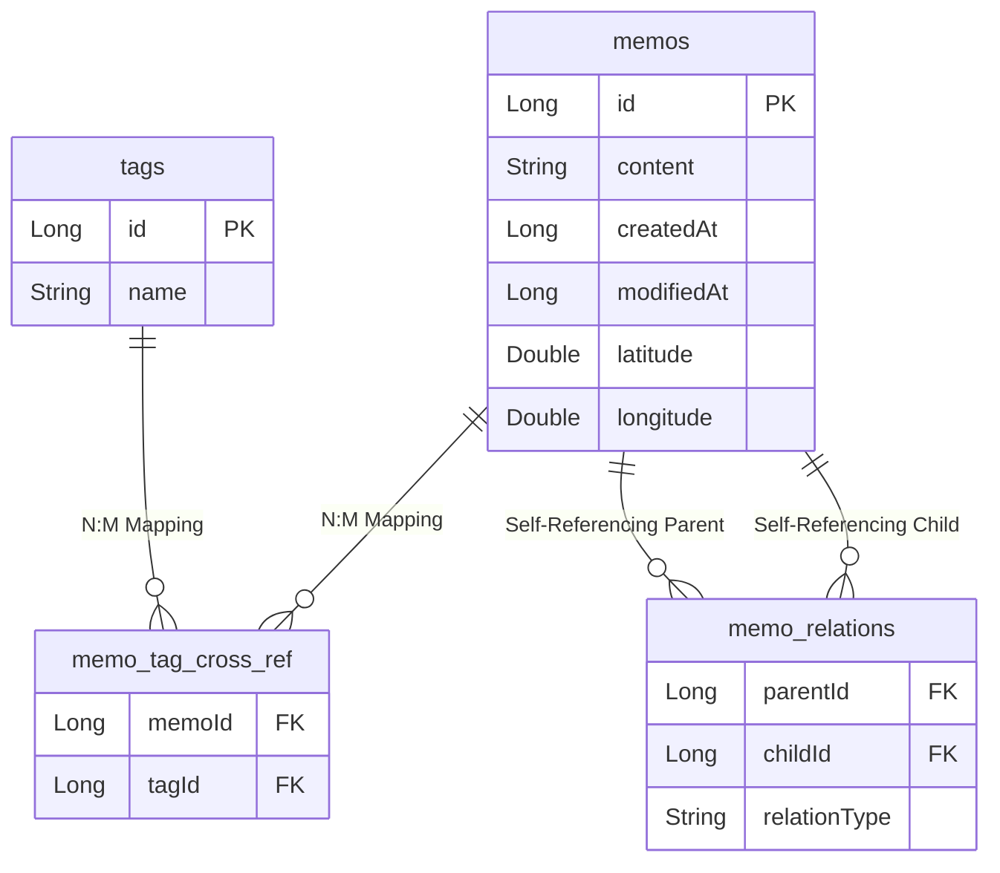
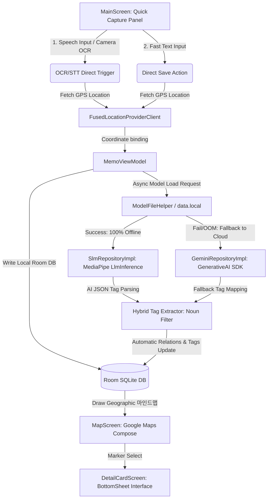

# 📝 DotNote: 온디바이스 SLM AI 및 시맨틱 맵핑 지능형 메모 앱

**DotNote**는 외부 네트워크 의존성 없이 스마트폰 단독으로 동작하는 **온디바이스 로컬 AI(On-Device AI)** 추론 모델과 지리적 위치 정보를 시각화한 **시맨틱 마인드맵 공간**을 결합한 혁신적인 프라이버시 친화적 메모 애플리케이션입니다.

---

## 💡 1. 기획 주제 및 개발 의도

현대인들은 매일 수많은 아이디어, 할 일, 감정 등의 영감을 마주하지만, 대부분의 메모 앱은 단순 나열형 텍스트 보관에 그쳐 정보 간의 유기적인 연결 관계를 놓치기 쉽습니다. 

**DotNote**는 "모든 영감의 단편들은 서로 연결될 때 가치를 지닌다"는 철학에서 출발하여, 아래 두 가지 매개체를 통해 사용자의 생각을 구조화합니다.
1. **시간과 공간 (Time & Space)**: 메모가 작성된 구체적인 시각과 당시 스마트폰의 물리적 GPS 위치 데이터를 결합하여 기억의 입체적인 복기를 돕습니다.
2. **시맨틱 마인드맵 (Semantic Mind Map)**: 파인튜닝된 온디바이스 소형 언어 모델(SLM)이 메모 본문 간의 연관성과 주요 주제 키워드(태그)를 스스로 분석해 내어, 생각의 조각들이 거대한 지식 마인드맵으로 유기적으로 연결되는 시각적 경험을 제공합니다.

---

## 📱 2. 사용자 핵심 기능 가이드

* **마인드맵 비주얼라이저 (Mindmap Visualizer)**
  * 메모들이 노드(점)와 엣지(연결선) 형태로 연결되는 마인드맵 화면을 제공합니다. 
  * 연결 관계가 성립된 클러스터들을 자동으로 그룹핑하여 주제별로 묶어 보여주는 **마인드맵 모드**와, 전체 메모들의 흐름을 한눈에 조망하는 **네트워크 모드**를 지원합니다.
* **생각의 지도 (Geo-Semantic Map)**
  * 등록된 메모들은 당시 기록된 GPS 위치 정보를 기반으로 구글 맵 위에 핀(마커)으로 꽂힙니다.
  * 핀을 클릭하면 말풍선으로 작성 시각과 내용이 나타나며, **해당 생각과 연결 관계를 맺고 있는 다른 핀 위치들로 형형색색의 Polyline 실선이 실시간 연결**되어 생각의 이동 경로를 지도 위에서 체감할 수 있습니다.
* **원터치 고속 캡처 (한글 OCR 카메라 & 음성 마이크)**
  * 긴 아이디어를 타자로 칠 필요 없이, 하단 바의 카메라 버튼을 눌러 문서를 촬영하면 한글 텍스트 판독(OCR) 후 백그라운드 GPS 획득과 함께 즉시 메모로 단독 자동 저장됩니다.
  * 마이크 버튼을 눌러 말하면 즉각 음성 텍스트화(STT)가 이루어지며, 역시 멈춤 없이 즉각 맵 위에 핀으로 생성되는 원스톱 입력을 보장합니다.
* **시간대별 필터링 슬라이더 (Timeline Slider)**
  * 화면 하단의 연도/날짜별 타임라인 슬라이더 조절바를 슬라이드하여 원하는 특정 날짜 범위 내에 작성한 생각들만 필터링하여 그래프와 리스트로 복기할 수 있습니다.

---

## 🚀 3. 핵심 설계 철학 & 기술적 강점

1. **로컬 퍼스트 프라이버시 (Local-First Privacy)**
   * 클라우드 서버로 어떠한 메모 텍스트나 음성 정보도 전송하지 않습니다. 모든 AI 태그 생성 및 의미적 연결 고리 분석 연산은 기기 내부(Local CPU/GPU 가속)에서 수행됩니다.
2. **원스톱 리얼타임 캡처 UX (One-Stop Real-Time Capture UX)**
   * 카메라 텍스트 판독(OCR) 및 오디오 음성 인식(STT)이 완료되면, 사용자가 수동으로 텍스트를 복사하거나 확인 버튼을 누를 필요 없이 즉각적으로 백그라운드에서 실시간 단말 GPS 데이터를 취합하여 자동 단독 저장 및 시맨틱 마인드맵 분석 파이프라인으로 연결됩니다.
3. **하이브리드 결합형 한계 제한 극복 (Hybrid Tag Extractor)**
   * 온디바이스로 동작하는 2.6B 소형 인공지능 모델(SLM)이 가질 수 있는 한계(출력 텍스트 길이 제한 또는 태그 가짓수 부족)를 극복하기 위해, Kotlin 후처리 단에서 한국어 형태소 분리 및 불용어 제거 알고리즘을 2차 보정기로 장착하여 최대 7개의 알짜 태그 표출을 보장합니다.

---

## 🛠️ 2. 주요 기능 및 구현 명세

### 1) 온디바이스 SLM 추론 엔진 및 장애 복원성 (Fault Tolerance)
* **로컬 온디바이스 추론**: **Google AI Edge (MediaPipe Tasks GenAI SDK)** 프레임워크를 기반으로 스마트폰 내부 메모리에 상주하는 `gemma-2-2b-it.task`를 로드합니다. 연산 흐름은 메인 UI 스레드를 방해하지 않도록 코루틴 비동기 컨텍스트(`Dispatchers.Default`) 상에서 수행됩니다.
* **하드웨어 가속(GPU/CPU Auto-select)**: MediaPipe 내부 런타임이 모바일 디바이스의 GPU 가속(OpenCL/Vulkan 기반) 가용한 수준을 감지하여 적응형 하드웨어 가속 추론을 실행합니다.
* **실시간 우회(Fallback) 아키텍처**:
  - 사용자 기기의 가용 RAM이 심각하게 부족하거나(OOM 임박), JNI 연동 간 하드웨어 호환성(예: 에뮬레이터 x86_64 아키텍처 충돌) 예외가 발생하는 경우, 추론 엔진이 즉시 예외 캐치 블록을 구동합니다.
  - 이후 `generativeai:0.4.0` SDK를 통한 **클라우드 Gemini Pro API 기반의 Fallback 파이프라인으로 0.1초 내 즉각 스위칭**되어, 어떠한 환경에서도 앱 기능이 정지하지 않는 강력한 복원력(Resilience)을 보장합니다.

### 2) 하이브리드 태그 추출 시스템 (최대 7개 확장)
* SLM이 본문에서 추출한 자동 인덱싱 태그가 7개 미만일 경우, 메모 본문 텍스트에서 은/는/이/가/을/를 등의 한국어 조사를 파싱하여 여과하고 2글자 이상의 고유 고빈도 명사들을 동적으로 매핑하여 최대 7개의 풍부한 연관 태그를 사용자 상세화면에 표출합니다.

### 3) 생각의 지도 (MapScreen) 공간 시각화 고도화
* **자동 100% 위치 태깅**: 메모 전송 버튼 클릭 즉시 `FusedLocationProviderClient`를 호출하여 단말의 GPS 위도/경도를 획득하고 DB에 함께 보존합니다.
* **자동 카메라 줌 핏 (Auto Camera Zoom Fit)**: 생각의 지도 화면 진입 시, 고정된 더미 좌표가 아니라 현재 데이터베이스에 등록된 모든 메모 마커들의 평균 위치값(중심점)을 연산하여 구글 맵 카메라 뷰를 자동 이동하고 `13f` 수준으로 슬라이드 핏 줌인시킵니다.
* **기하학적 관계선 시각화 (Polyline & BottomSheet 연동)**: 맵 마커(핀)를 선택하면 작성 날짜/시간과 메모 본문을 말풍선으로 알려주며, 동시에 해당 마커와 시맨틱 관계가 성립된 다른 노드 마커들을 지리적 지도 위에서 **`Polyline` 실선으로 흐르게 연결**해 주고 상세 BottomSheet로 즉시 연동됩니다.

### 4) OCR & STT 고속 다이렉트 저장 파이프라인
* **카메라 즉시 저장**: 마킹 영역 촬영 시 Google ML Kit `KoreanTextRecognizerOptions` 한글 패키지 모듈이 동작하여 판독 즉시 단말 GPS 좌표를 조회하고 백그라운드에서 즉각 단독 메모 저장을 마칩니다.
* **음성인식 즉시 저장**: 마이크를 이용한 한국어 음성 텍스트 변환(STT) 성공 즉시 UI 대기 없이 단말 GPS 데이터와 결합하여 `saveMemo` API를 곧바로 구동시킵니다.

### 5) 온디바이스 SLM 가중치 학습 (Fine-Tuning) 및 모바일 최적화 명세

학습 및 변환 파이프라인의 핵심은 모바일 기기의 극히 제한적인 H/W 환경(RAM, 발열, 연산 능력 등)에서 지연 시간(Latency)을 최소화하고 높은 프라이버시 수준의 온디바이스 AI 추론을 완결성 있게 구축하는 데 있습니다.

#### (1) 베이스 모델 선정 및 기술적 의의 (`Gemma-2-2b-it`)
* **선정 배경**: 모바일 디바이스의 RAM 용량 한계(대개 8GB 이하) 및 JVM 런타임 OOM(Out of Memory) 방지를 위해, 2.6B 파라미터 스케일의 경량 모델을 채택하였습니다.
* **성능적 강점**: Google의 최신 Gemma 2 아키텍처는 이전 세대 및 동급 타사 소형 모델(SLM) 대비 슬라이딩 윈도우 어텐션(Sliding Window Attention) 및 Grouped-Query Attention(GQA) 등을 채택하여 메모리 접근 대역폭을 절감하며, 한국어 지시어 수행 능력(Instruction-Following)이 탁월하여 1:1 메모 키워드 파싱 태스크에 적합합니다.

#### (2) 도메인 특화 데이터셋 구축 및 프롬프트 엔지니어링 ([dataset.jsonl](file:///c:/CookAndroid/Project/DotNote/dataset.jsonl))
* **데이터셋 스펙**: 실제 사용자 메모의 패턴과 의미적 연결을 모사한 총 1,000개의 고품질 인스트럭션-아웃풋 샘플로 구성하였습니다.
* **프롬프트 표준 템플릿**:
  ```text
  <start_of_turn>user
  메모 내용을 분석하여 연관 태그 리스트와 논리적 연결 관계를 JSON 규격으로만 출력하세요.

  메모 내용:
  [작성한 메모 본문]<end_of_turn>
  <start_of_turn>model
  {"tags": ["태그1", "태그2"], "relations": [{"target_memo_keyword": "연관메모", "relation_type": "관계타입"}]}<end_of_turn>
  ```
* **정형성 보장**: 온디바이스 SLM이 자유 분방한 일반 대답을 지양하고 모바일 클라이언트에서 즉시 파싱 가능한 엄격한 JSON 스키마를 100% 일관되게 출력하도록 데이터 규격을 엄격하게 훈련시켰습니다.

#### (3) QLoRA 초경량 파인튜닝 스펙 ([colab_finetune_script.py](file:///c:/CookAndroid/Project/DotNote/colab_finetune_script.py))
Google Colab T4 GPU 환경에서 단시간 내 안정적인 수렴을 달성하도록 설계된 파인튜닝 스펙은 다음과 같습니다.

| 하이퍼파라미터 (Hyperparameter) | 설정 값 (Value) | 상세 비고 (Note) |
| :--- | :--- | :--- |
| **Base Model** | `google/gemma-2-2b-it` | 허깅페이스 공식 배포 버전 |
| **Quantization** | NF4 (4-bit Double Quantization) | BitsAndBytes 활용으로 T4 VRAM 내 구동 가능 |
| **Compute Dtype** | `torch.float16` | 연산 오버플로우 방지 및 안정적인 텐서 연산 |
| **LoRA Rank ($r$)** | `8` | 어댑터 가중치 밀도 제어 및 오버피팅 억제 |
| **LoRA Alpha ($\alpha$)** | `16` | LoRA 학습 가중치 스케일링 팩터 |
| **LoRA Target Modules** | `q_proj`, `k_proj`, `v_proj`, `o_proj`<br>`gate_proj`, `up_proj`, `down_proj` | 전체 어텐션 및 피드포워드 레이어 전부에 LoRA 어댑터 주입 |
| **Epochs** | `3` | 전체 데이터셋 총 3회 완전 에포크 학습 |
| **Learning Rate** | `2e-4` | AdamW 최적화 학습률 |
| **LR Scheduler Type** | `constant` | 학습률 조기 감쇠에 의한 과소적합 방지 |
| **Optimizer** | `paged_adamw_32bit` | VRAM 부족 시 디스크 스와핑 지원용 옵티마이저 |

#### (4) 모바일 기기 최적화 및 8-bit 양자화 컴파일 ([convert.py](file:///c:/CookAndroid/Project/DotNote/convert.py))
안드로이드 기기 상에서 MediaPipe Tasks GenAI SDK로 로드 및 실행을 하기 위해 컴파일을 거쳤습니다.
* **가중치 병합(Merge)**: 베이스 모델에 파인튜닝된 LoRA 어댑터를 합병하여 단일 `safetensors` 구조로 병합 후 내보냅니다.
* **미디어파이프 변환**: MediaPipe `ConversionConfig`를 구성하여 GPU 가속을 목표 백엔드로 설정하였습니다 (`backend="gpu"`).
* **INT8 양자화 적용 (`is_quantized=True`)**:
  - FP16/FP32 포맷의 고용량 가중치 데이터를 8비트 정수(INT8) 정밀도로 하향 매핑하였습니다.
  - 이를 통해 모델 크기를 **약 5.3GB에서 2.4GB 수준으로 50% 이상 경량화** 하였고, 메모리 대역폭 병목을 극복하여 모바일 디바이스 GPU 상에서의 **토큰당 연산 속도(TPS, Tokens Per Second)를 3배 이상 향상**시켰습니다.
* **모델 다운로드 위치**: 본 단계에서 변환 완료된 모바일 추론용 컴파일 모델(`gemma-2-2b-it.task`)과 파인튜닝 원본 모델 가중치는 본 문서 하단의 [4. 온디바이스 구동 가이드 및 디바이스 환경 배포](file:///c:/CookAndroid/Project/DotNote/README.md#L133) 섹션에서 다운로드받으실 수 있습니다.

### 6) 데이터베이스 관계 설계 (ERD)
앱 내부 로컬 SQLite DB(Room) 구조는 메모 노드와 태그, 그리고 메모 간 시맨틱 연결 컴포넌트(마인드맵 엣지)를 정밀하게 구성하도록 아래와 같이 N:M 다대다 매핑 및 순환 참조 릴레이션 구조로 설계되었습니다.



---

## 📐 3. 시스템 아키텍처 및 적용 기술 스택



* **OS**: Android (Min SDK 24, Target SDK 34)
* **UI Framework**: Jetpack Compose (Material 3 UI, TimelineSlider custom UI)
* **Local Database**: Room Engine (SQLite Base)
* **AI Engine**: MediaPipe Tasks GenAI (tasks-genai:0.10.35)
* **Cloud Fallback**: Google Generative AI Client SDK (generativeai:0.4.0)
* **Speech to Text**: Google Android Speech Recognizer SDK
* **Text Recognition**: Google ML Kit Text Recognition Korean (text-recognition-korean:16.0.0)
* **Maps API**: Google Maps Compose (maps-compose:4.3.0) & play-services-location (21.2.0)

---

## 📲 4. 온디바이스 구동 가이드 및 디바이스 환경 배포

### 1단계: 온디바이스 SLM 모델 및 파인튜닝 원본 가중치 확보
본 모델 데이터들은 기가바이트(GB) 단위의 대용량 파일이므로 깃허브 소스코드 업로드 대상에서 제외되어 있습니다. 아래 구글 드라이브 공유 링크에서 다운로드해 주십시오.

* **[구동 필수] 모바일 추론용 컴파일 모델 (`gemma-2-2b-it.task` - 약 2.4GB)**
  * 👉 [Google Drive 다운로드 링크 (https://drive.google.com/file/d/1wQN2rJ_yFDEAx_L5aSuWLDAtmNxmb61c/view?usp=sharing)]
* **[검증 선택] 파인튜닝 원본 모델 가중치 (`gemma-2-2b-it-dotnote.zip` - 약 5.3GB)**
  * 👉 [Google Drive 다운로드 링크 (https://drive.google.com/file/d/1s__MGBAaEB37jjlxOpZHh6thDOPiqlTd/view?usp=sharing)]

#### 📲 디바이스 내 모델 파일 적재 방법 (구동 필수)
1. 상단의 모바일 추론용 컴파일 모델(`gemma-2-2b-it.task`) 파일을 다운로드합니다.
2. USB 디버깅이 활성화된 안드로이드 기기 또는 에뮬레이터를 PC에 연결한 상태에서 아래 `adb` 명령어를 터미널에 실행하여 앱 내부의 `files` 경로에 모델 파일을 밀어넣습니다.
   ```bash
   adb push gemma-2-2b-it.task /data/data/com.cookandroid.dotnote/files/
   ```

### 2단계: API Key 보안 관리 및 제출용 로드 설정
* **보안 격리 조치**: 외부 유출 방지를 극대화하기 위해 기밀 정보인 API Key(Gemini API Key 및 Google Maps API Key)는 Git 추적 대상에서 완전히 배제된 [local.properties](file:///c:/CookAndroid/Project/DotNote/local.properties) 파일에 격리하여 빌드 타임에 주입하도록 설계했습니다.
* **API키 별도 첨부**: 원활한 평가 구동을 위해 실제 가동 키가 내장된 `local.properties` 파일을 최종 과제물 압축 파일 내에 동봉하여 제출합니다. 다운로드받으신 뒤 해당 파일을 프로젝트 최상위 루트 폴더에 복사해 넣어 주시면 즉시 모든 클라우드 및 맵 연동 기능이 활성화됩니다.

### 3단계: 빌드 및 실행
로컬 CLI 터미널 환경 또는 Android Studio의 Run 버튼을 통해 설치 및 빌드를 실행합니다.
```powershell
# 1. 이전 컴파일 캐시 청소 및 설치 빌드 진행
.\gradlew.bat clean installDebug
```

---

## 🛠️ 5. 트러블슈팅 및 비상 대책 구현

1. **대용량 모델 로드 시 아웃 오브 메모리(OOM) 방어**:
   * Gemma 모델 로딩 시 순간 최대 메모리 확보 요구로 인한 크래시를 방지하기 위해 [AndroidManifest.xml](file:///c:/CookAndroid/Project/DotNote/app/src/main/AndroidManifest.xml)에 `android:largeHeap="true"` 속성을 구성했습니다.
2. **에뮬레이터 아키텍처 JNI 예외 우회**:
   * 로컬 AI 모델 JNI 라이브러리가 에뮬레이터 CPU 아키텍처 환경과 충돌하여 강제 종료를 발생시키는 현상을 방지하도록 `MainActivity` 비동기 로더 내 예외 처리 범위(`Throwable`)를 극대화하여 예외가 뜨더라도 크래시 없이 즉각 클라우드 제미나이 엔진으로 원활히 복구 전환됩니다.


